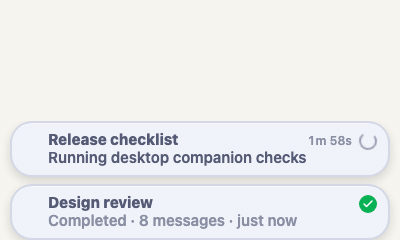
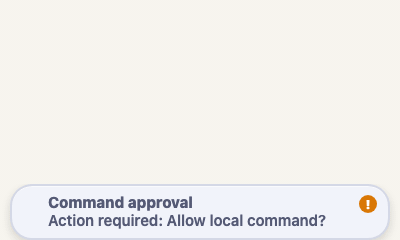
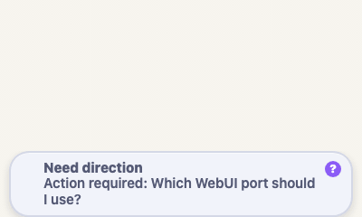
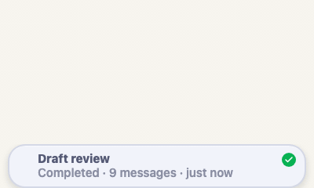
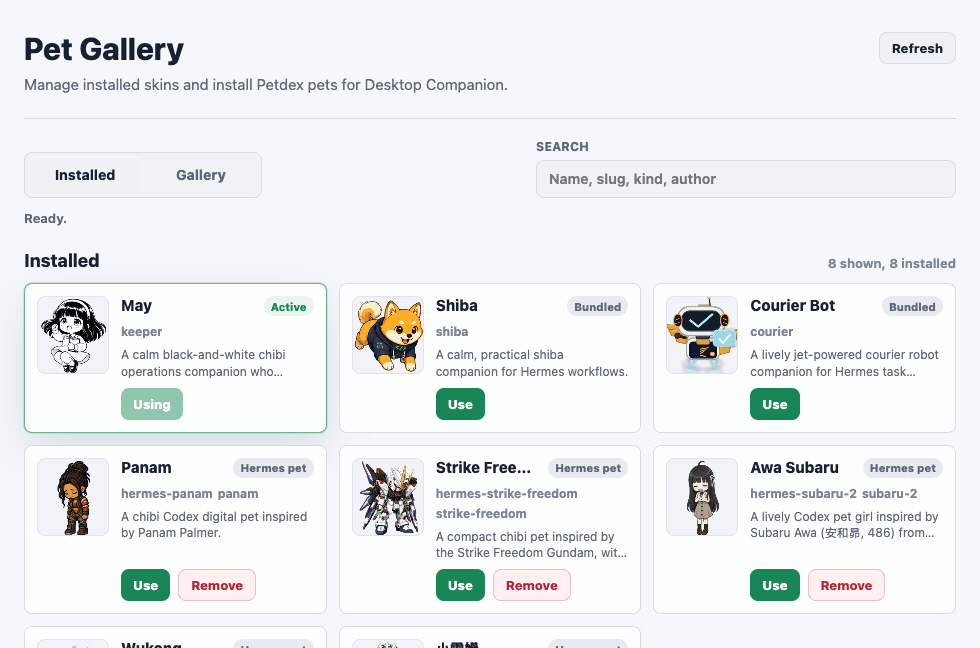

# Hermes WebUI Desktop Companion

Hermes WebUI Desktop Companion is a trusted-local companion for Hermes WebUI: a
native desktop pet that watches real WebUI session state, surfaces work that
needs attention, and opens the right WebUI tab when you click it.

The WebUI integration is a manifest-bundled extension. Desktop-only behavior
stays outside the Hermes WebUI core repo in a local loopback sidecar and native
Tauri host.

<p align="center">
  
</p>

## Feature highlights

| Feature | What it does |
| --- | --- |
| Native Desktop Pet | Runs as a transparent always-on-top desktop window instead of an in-page browser widget. |
| WebUI attention bridge | Watches running, ready, approval, and clarify states from Hermes WebUI and shows desktop bubbles when work needs attention. |
| Click to WebUI | Clicking the pet focuses or opens the matching Hermes WebUI tab without refreshing an already-open target session. |
| Pet Gallery / Manager | Searches live Petdex results, installs Hermes pets, switches skins, and removes installed pets. |
| Permission control | Direct quick replies and inline approval/clarify responses are default-off and require explicit local opt-in. |

## Feature tour

### Desktop Pet

The visible companion is the native desktop pet. It reacts to WebUI state and
keeps the browser integration out of the page layout.

<p>
  
</p>

### Attention Bubbles

The WebUI adapter sends session attention state to the local sidecar, so the
desktop pet can surface running work, completed sessions, and approval prompts
without rendering browser UI.

#### Running and ready sessions

Passive bubbles show what is still running and what is ready for review.

<p>
  
</p>

#### Approval prompts

Approval-required work expands in place so the user can review the command and
choose whether to allow it.

<p>
  
</p>

#### Clarify prompts

Clarify bubbles can show choices, then expand to an explicit text response when
the predefined options are not enough.

<p>
  
</p>

#### Quick reply safety

Quick replies are available from completed-session bubbles, but direct sending
is gated by an explicit local permission prompt.

<p>
  
</p>

### Pet Gallery / Manager

The manager keeps installed skins and Petdex discovery in one local view while
delegating install/remove operations to the Hermes pet CLI when possible. If
the local CLI is behind Petdex's live approval state, the sidecar can fall back
to Petdex's install metadata and write the pet into the local Hermes pets
directory. `May` stays bundled as the offline/default fallback so the desktop
pet and the manager entry remain available even before a user installs any
Petdex pets. The manager follows the system light/dark appearance so the native
manager fits the current desktop theme.



## Project shape

The current milestone includes:

- a manifest-bundled WebUI extension under `extension/`
- Desktop Pet skins migrated from Hermes WebUI PR #2916
- a local loopback companion server under `src/`
- the Tauri desktop pet shell under `desktop-pet/`
- Pet Gallery / Manager support for installed Hermes pet skins
- scripts for wiring the companion into a local Hermes WebUI run
- a reserved `winui/` folder for the future native Windows host

## Current shape

```text
Hermes WebUI page
  -> Gallery-installed Desktop Companion bridge
  -> injected /extensions/desktop-companion/assets/companion-adapter.js
  -> http://127.0.0.1:17787 loopback API
  -> Tauri desktop companion runtime
```

The extension plugin is trusted JavaScript running in the Hermes WebUI origin.
It does not render a browser pet. It polls existing WebUI session APIs for
lightweight attention state and sends a companion snapshot to the local loopback
server so the native desktop pet can react on the desktop.

`extension/manifest.json` also declares the desktop runtime as a loopback
sidecar:

```json
{
  "sidecar": {
    "type": "loopback",
    "origin": "http://127.0.0.1:17787",
    "health_path": "/health"
  }
}
```

Hermes WebUI can use this field for extension diagnostics, sidecar health
display, and any consent-gated fixed sidecar proxy surface it supports. It still
does not imply auto-install, auto-start, or native host permission.

`extension/extension.json` also declares a small management contract for future
extension settings UI:

- install points to this repo's first-time setup instructions
- start shows `npm run start:pet` as the local runtime command
- manager opens the sidecar-hosted Pet Gallery at `/pet/gallery` after the
  sidecar is running

The same management contract is returned from `/health` for diagnostics. It is
metadata for user-visible actions, not a silent native installer.

It should stay small, auditable, additive, and reversible. It must not render
browser UI, replace WebUI containers, or depend on private DOM structure.

Naming note: "Desktop Companion" is the project boundary. "Desktop Pet" is the
current desktop surface inside that companion. If the community uses "Desktop
Pad" for the broader idea, this repo should still describe the installable
package as Desktop Companion and the current visual surface as Desktop Pet.

## Quick start

### After Gallery install

Installing Desktop Companion from the Hermes WebUI Gallery installs the WebUI
bridge only. It does not install or launch the local desktop app. The desktop
pet appears after the local Desktop Companion runtime is running on this
machine.

#### First-time setup

Use this path the first time you try Desktop Companion on a machine:

1. In Hermes WebUI, open Settings -> Extensions -> Gallery and install
   Desktop Companion.
2. Clone this repo and install the root package.

```bash
git clone https://github.com/franksong2702/hermes-webui-desktop-companion
cd hermes-webui-desktop-companion
npm install
```

3. Start the local sidecar and native Desktop Pet app.

```bash
npm run start:pet
```

4. Open or reload Hermes WebUI.

No browser pet should appear. The visible pet is the native desktop window. When
Hermes WebUI has the Gallery-installed adapter loaded, session updates,
completion reminders, approvals, and clarify prompts can appear above the
desktop pet.

#### Start or restart after it is installed

If Desktop Companion was already cloned and set up, use the same command any
time you want to start it again:

```bash
cd hermes-webui-desktop-companion
npm run start:pet
```

This is also the recovery path after you close the pet from its right-click menu
or stop the terminal process.

`npm run start:pet` starts the local loopback sidecar at
`http://127.0.0.1:17787` and launches the native Tauri Desktop Pet. If
`desktop-pet` dependencies are missing, the script installs them first.

To stop Desktop Companion during local testing, use the pet's right-click menu
or press `Ctrl-C` in the terminal running `npm run start:pet`.

If Hermes WebUI shows Desktop Companion as installed but the pet does not react,
check that `npm run start:pet` is still running and then reload Hermes WebUI.

### Manual extension mode

For older WebUI builds or local extension-asset development, print the Hermes
WebUI extension environment:

```bash
./scripts/print-webui-env.sh
```

Use the printed environment when starting Hermes WebUI from the WebUI repo:

```bash
cd /path/to/hermes-webui
HERMES_WEBUI_EXTENSION_DIR=/path/to/hermes-webui-desktop-companion/extension \
HERMES_WEBUI_EXTENSION_MANIFEST=manifest.json \
./start.sh
```

You can also start WebUI in plugin mode directly:

```bash
./scripts/start-webui-plugin-mode.sh /path/to/hermes-webui
```

Run the local companion loopback server and native desktop pet shell separately
when debugging each process:

```bash
npm run dev
npm run desktop:dev
```

The Tauri shell loads `http://127.0.0.1:17787/pet` and
`http://127.0.0.1:17787/pet/bubbles`. It no longer depends on Hermes WebUI
serving `/pet`, `/pet/bubbles`, or `/api/pet/*`.

### Gallery status

Desktop Companion is published in the Hermes WebUI extension registry. The
expected flow is:

1. Install Desktop Companion from Settings -> Extensions -> Gallery.
2. Start the local companion runtime from this repo with `npm run start:pet`.
3. Reload WebUI so the browser adapter can post snapshots to the sidecar.

The Gallery entry intentionally does not install or auto-start the native
sidecar/Tauri host. Those remain local Desktop Companion runtime processes.
Future WebUI extension settings can read the manifest `management` field or the
sidecar `/health` response to show install, start, health, and Pet Gallery
actions in one place.

Older WebUI builds without `HERMES_WEBUI_EXTENSION_MANIFEST` can still load the
adapter with explicit asset lists:

```bash
HERMES_WEBUI_EXTENSION_DIR=/path/to/hermes-webui-desktop-companion/extension \
HERMES_WEBUI_EXTENSION_SCRIPT_URLS=/extensions/companion-adapter.js \
./start.sh
```

## Pet skins and packs

Desktop Companion exposes a small Pet Pack contract for pet skins and advanced
pet packs. The contract keeps the WebUI adapter snapshot as the low-level state
outlet, and the sidecar APIs as the normalized Desktop Companion surface. Start
with [`docs/pet-pack-contract.md`](docs/pet-pack-contract.md).

The user-facing model is "choose a Pet Skin." Some future packs may bring their
own display implementation, but that remains an implementation detail behind the
selected skin. Pet displays can discover the contract version, stable endpoints,
status values, and optional action capabilities through
`GET /api/pet/capabilities`.

## Disable and uninstall

To disable the WebUI extension, restart Hermes WebUI without:

```text
HERMES_WEBUI_EXTENSION_DIR
HERMES_WEBUI_EXTENSION_MANIFEST
HERMES_WEBUI_EXTENSION_STYLESHEET_URLS
HERMES_WEBUI_EXTENSION_SCRIPT_URLS
```

To stop the sidecar, stop the `npm run dev` process. To remove the project,
delete this repository clone after stopping the sidecar and any native desktop
host process.

## Trust model

This project is for trusted local use. The injected adapter can call WebUI APIs
with the same browser session authority as the logged-in user. Only enable it
from a directory you control.

The loopback server does not authenticate loopback requests itself in the
current local beta. It binds to `127.0.0.1` by default and only accepts loopback
WebUI origins by default. Do not expose it on a public interface.

The sidecar serves local pet assets and stores only the latest in-memory WebUI
snapshot received from the adapter. It persists only local pet preferences under
the current user's home directory. It does not persist session data or read
Hermes credentials.

The sidecar also detects installed Hermes pet skins from
`<HERMES_HOME>/pets`, defaulting to `~/.hermes/pets`, and exposes those
spritesheets through its loopback `/api/pet/skins` response. The native pet
right-click menu keeps quick switching for installed skins and opens a local Pet
Gallery / Manager for searching Petdex, installing Hermes pets, removing
installed Hermes pets, and applying a supported installed skin to Desktop
Companion. Install operations prefer the local `hermes pets` CLI and fall back
to Petdex install metadata when the CLI's static manifest has not caught up with
live Petdex approvals. Remove operations still use the local `hermes pets` CLI
so Desktop Companion does not become a second pet store.

Direct quick-reply sending and inline approval/clarify responses are default-off
local permissions. The first attempt from the desktop pet shows a confirmation
card; users can also toggle both permissions from the pet right-click menu under
`Permission control`.

## Compatibility

Current required WebUI capabilities:

- extension manifest bundles through `HERMES_WEBUI_EXTENSION_MANIFEST`
- same-origin extension assets under `/extensions/`
- browser access to existing authenticated WebUI session APIs
- loopback browser access to `http://127.0.0.1:17787`

Current optional WebUI capabilities:

- sanitized sidecar diagnostics and browser-side health display from the
  manifest `sidecar` declaration
- consent-gated fixed sidecar proxy paths for extensions that need same-origin
  browser requests to a declared loopback helper
- browser-local extension settings/storage if a future Desktop Companion
  manifest needs user-editable extension settings

Pending or future WebUI capabilities:

- WebUI-managed sidecar/native-host lifecycle
- a formal extension runtime API for live session state and companion actions,
  so the adapter can rely less on guarded WebUI globals
- richer backend bridge support if a future feature outgrows the direct
  browser/loopback/proxy path

See `docs/compatibility.md` for the current compatibility notes.

## Development

```bash
npm test
npm run dev
```

The root package currently has no runtime npm dependencies. The native Tauri
shell manages its own dependencies under `desktop-pet/`, and
`npm run start:pet` installs them when missing.

## Extension-library fit

Desktop Companion should stay in the Hermes WebUI extension ecosystem as a
richer trusted-local example, not as a WebUI core patch:

- extension assets are packaged by `extension/manifest.json`
- WebUI core changes are not required
- the local sidecar binds to `127.0.0.1` and owns desktop-only protocol state
- the manifest documents the sidecar with `type`, `origin`, and `health_path`
- the Tauri host remains outside Hermes WebUI
- official WebUI extension backend support can replace or formalize the sidecar
  boundary when that upstream API is ready

See `docs/extension-library-submission.md` for the proposed submission shape.

## Roadmap

- Expand the snapshot and action protocol.
- Add a native Windows host in `winui/`.
- Broaden consent UX for any new companion action that triggers WebUI APIs.
- Track upstream extension runtime and backend-bridge work.

## Migration Notes

The initial runnable plugin-mode pet migrates the #2916 skin assets and the
spritesheet animation model plus the Tauri desktop shell. It intentionally does
not migrate WebUI Python routes, settings controls, slash commands, or WebUI
launch/install routes. Those become companion-owned or protocol-owned features
instead of WebUI core changes.
